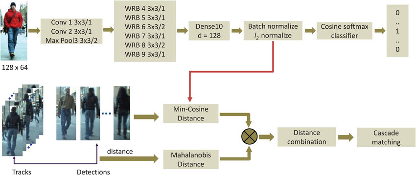

# Advanced Traffic Dashboard

This project was built as a part of M# Hackathon for TechTatva 2023, This is a Interactive traffic Dashboard that gives real time data analysis on a CCTV Footage using a YOLOVX Machine Learning model using Coco Weights. 


## Authors

- [@klaudius](https://github.com/KIaudius)

## Problem Statement
In Tier 1 cities, the intertwining problems of traffic
congestion and air pollution have reached alarming
levels, posing serious threats to the well-being of
residents and the environment. The relentless growth
in the number of vehicles on the roads has led to daily
gridlock, extended commute times, and heightened
stress for the population. Furthermore, this excessive
vehicular traffic is a significant contributor to the
deteriorating air quality in these urban areas, with
hazardous implications for public health.The adverse
effects of this situation are far-reaching,
encompassing increased rates of respiratory illnesses,
cardiovascular diseases, and a reduced overall quality
of life. The economic impact is also substantial, with
businesses facing delivery delays, increased
operational costs, and reduced customer accessibility.

## Contributing

Contributions are always welcome!

Please adhere to this project's `code of conduct`.


## Deployment

Download YOLOX-S,M,L weights in [this repository](https://github.com/Megvii-BaseDetection/YOLOX) and add in ```./weights``` folder and prepare your video input (Ex: [this video](https://drive.google.com/file/d/1K9NINYSs0edtCjVeICFMkCM7KTmVshu5/view?usp=sharing))

__To deploy this project__, open the file 'deploy_app.ipynb' on google collab and you'll be good to go  :))

 **Note**: The reason I don't deploy this repository to *Heroku* because it's very heavy, runs **1-2 FPS** with CPU. So I used *ngrok* to be able to deploy online and used Colab to take advantage of the GPU. However, run it if you have a powerful enough GPU (Colab's GPU runs around **8-14 FPS**, quite slow but better than CPU) 
```

```


## Acknowledgements

 - [The Machine Learning Model and how to train self models](https://github.com/sonnguyen129/Traffic-Flow-Analysis)
 - [YOLOX: Exceeding YOLO Series in 2021](https://arxiv.org/pdf/2107.08430.pdf)
 - [Simple Online and Realtime Tracking with a Deep Association Metric](https://arxiv.org/pdf/1703.07402.pdf)
 - [YOLOX](https://github.com/Megvii-BaseDetection/YOLOX)
 - [DeepSORT](https://github.com/ZQPei/deep_sort_pytorch)

### DeepSORT

**DeepSORT** was developed immediately [SORT](https://arxiv.org/pdf/1602.00763.pdf) to address the omission problems associated with a high number of ID switches. The solution proposed by DeepSORT is based on the use of deep learning to extract features of objects to increase accuracy in the data association process. In addition, a linking strategy was also built called **Matching Cascade** to help link objects after disappearing for a while more effectively.



## Demo

__Simulation Example__


*WORK IN PROGRESS*
## Features

- Traffic Simulation 
- Live previews
- Fullscreen mode
- Cross platform
- interactive graphs
- average speed of vehicles
- environmental impact based on vehicle class
- input video details

